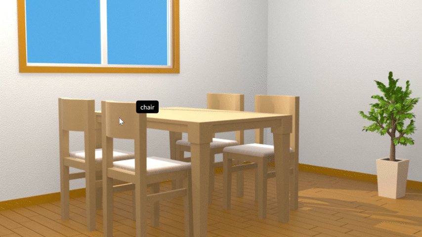

# Alpha Mapping Demo
デモページ  
[https://kakoikeisuke.github.io/alpha-mapping-demo/sample-room/](https://kakoikeisuke.github.io/alpha-mapping-demo/sample-room/)  

## 概要
このリポジトリは, PNGファイルのアルファチャンネルを一意のIDとして利用し, 画像内のオブジェクトを識別するコードのデモです。  
3DCGのレンダーのAOVなどによって作成された画像を使用することを想定しています。

## 挙動
はじめにPNG画像のRGBAの情報を取得します。  
その後,アルファチャンネルを無視して（完全に不透明であるとして）canvasに描画します。  
マウスやタッチの位置を取得し, その場所にもともと指定されていたアルファチャンネルの値からオブジェクトの名前を照合しています。

## 画像について
アルファをIDのように使用しているため, 表示自体は不透明になることを前提としています。  
また, RGBの情報をそのまま描画するため, RGBの値とアルファの値は完全に独立したもの（ストレート）として用意しておく必要があります。  
アルファをRGBに乗算した形式（プリマルチプライドアルファ）の場合, 表示が崩れてしまいます。

## デモの画像について
デモで使用している画像はSideFX Houdiniで作成しています。  
Karmaレンダーでレンダリングした後, Copernicusにてアトリビュートをもとにアルファ情報を加えて出力しています。